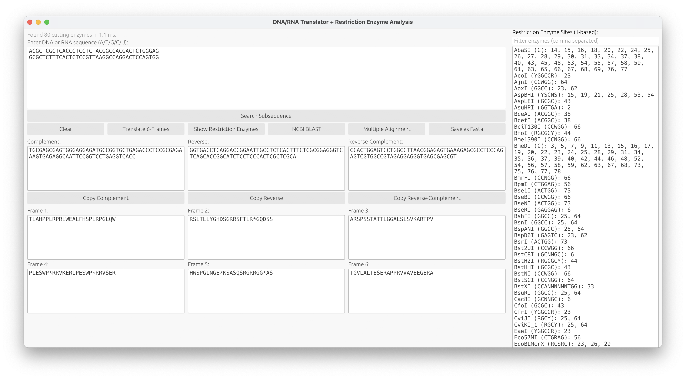
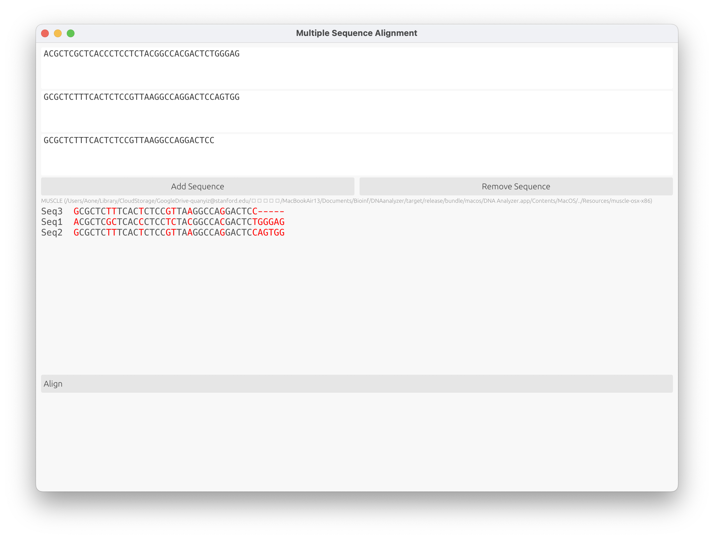

# DNA Analyzer 2.0

DNA Analyzer is a fast native desktop application for DNA and RNA analysis. It is written in Rust with egui and builds from one codebase for Windows, macOS, and Linux. The application does not require Python, PyQt, or Biopython at runtime.

## Screenshots

### Main analysis window



### Multiple sequence alignment



## Features

- Automatic DNA and RNA detection and cleanup
- Complete IUPAC ambiguous-base support
- Complement, reverse, reverse-complement, and GC calculations
- Six-frame translation for forward and reverse-complement strands
- Parallel scanning against 1,088 restriction enzyme definitions
- Restriction enzyme results in the right side of the main window
- Overlapping subsequence search with numbered ORIGIN-style highlighting
- NCBI BLAST integration through the default web browser
- Multiple sequence alignment in a separate native window
- MUSCLE alignment with a built-in Rust progressive aligner as fallback
- FASTA, GenBank ORIGIN, and plain-sequence input
- File drag and drop
- Numbered ORIGIN-style export compatible with the original application

## User interface

The main window preserves the layout of the original application. Search, translation, restriction analysis, BLAST, multiple alignment, and save controls remain in their original positions. Restriction results expand on the far right. Search and multiple alignment open as independent native windows rather than tabs.

## Opening an unsigned macOS build

Release artifacts are unsigned unless the repository's Apple signing secrets are configured. If macOS blocks the application after you have downloaded it from this repository's GitHub Releases page and verified its checksum, move the application to /Applications, then remove its quarantine attribute:

```bash
xattr -dr com.apple.quarantine "/Applications/DNA\ Analyzer.app"
```
Only run this command for an application whose source you trust. It recursively removes the Gatekeeper quarantine attribute from that application bundle.

## Run from source

Install a stable Rust toolchain, then run:

```bash
cargo run --release
```

DNA Analyzer searches for MUSCLE in this order:

1. The `MUSCLE_PATH` environment variable
2. The executable directory or application resource directory
3. The current directory
4. `muscle` or `muscle5` on the system `PATH`

The repository includes platform-specific MUSCLE executables:

- `muscle-win64.exe`
- `muscle-osx-arm64`
- `muscle-osx-x86`
- `muscle-linux-x86`

If MUSCLE cannot run, DNA Analyzer automatically uses its built-in Rust alignment engine.

## ORIGIN-style export

The `Save as Fasta` button deliberately preserves the original application's numbered ORIGIN-style output. The result is not standard FASTA sequence wrapping. It contains a FASTA header, one-based line coordinates, groups of 10 bases, up to 60 bases per line, and a final `//` marker.

```text
>sequence_1
        1 ACGTACGTAC ACGTACGTAC
//
```

## Test

```bash
cargo fmt -- --check
cargo test --locked
cargo clippy --all-targets -- -D warnings
```

The test suite covers input parsing, IUPAC complements, six-frame translation, overlapping search, ORIGIN-style export, forward and reverse restriction cuts, the built-in progressive aligner, and MUSCLE FASTA parsing.

## Build release packages

Build an optimized native executable:

```bash
cargo build --locked --release
```

Build a complete macOS application bundle:

```bash
brew install gcc@11
scripts/package_macos.sh
```

The output is written to:

```text
target/release/bundle/macos/DNA Analyzer.app
```

The packaging script copies `libgomp`, `libstdc++`, and `libgcc_s` into `Contents/Frameworks`, rewrites MUSCLE's load paths, and signs the complete bundle. The destination Mac does not need Homebrew or GCC. The build machine needs `gcc@11` only while assembling the application.

Native window-state persistence is disabled to avoid the AppKit Touch Bar KVO teardown crash seen on some Intel Macs. Search and multiple alignment use dedicated window processes, and the main application cleans them up when it exits.

GitHub Actions tests the analysis core and produces these artifacts:

- Windows x64 ZIP
- macOS Apple Silicon application bundle
- macOS Intel application bundle
- Linux x64 tarball

Public macOS distribution still requires Apple Developer ID signing and notarization. Public Windows distribution should use Authenticode signing.

## Project structure

```text
src/lib.rs                         Sequence parsing and analysis core
src/restriction.rs                 Parallel restriction enzyme scanner
src/alignment.rs                   MUSCLE runner and built-in alignment engine
src/app.rs                         Native egui interface
assets/restriction_enzymes.tsv     Compiled restriction enzyme data
docs/images/                       Application screenshots
tools/generate_restriction_db.py   Restriction database maintenance tool
scripts/package_macos.sh           Self-contained macOS bundle builder
.github/workflows/build.yml        Cross-platform continuous integration
```

The restriction enzyme table was generated from Biopython 1.86 `Bio.Restriction` data. Python is required only when a maintainer regenerates this static table.

MUSCLE and the bundled GCC runtime libraries retain their respective open-source licenses. See [THIRD_PARTY_NOTICES.md](THIRD_PARTY_NOTICES.md).

## License

MIT
